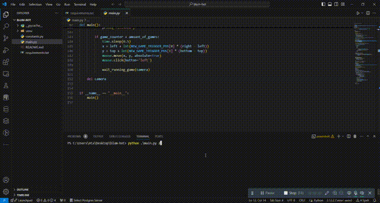

# BlumBot
___
A simple autoclicker for blum airdrop mini-game on python

## Requirements
- Python 3.10 or higher on Windows
- To install the required packages, run the following command:

```bash
pip install -r requirements.txt
```

## Usage
 - Open blum airdrop mini-game, then run `main.py` and press play
 - You can run `main.py play --games [amount_of_games]`, where `[amount_of_games]` is number of times playing the game
```bash
python main.py play --games 50
```
- For generating config files(colors) run this command:
```bash
python main.py config --timer --blum --dogs
```
- You can also generate config files (.json) manually. Just use a color picker tool :) (Recommended)
### Will I be banned for using this script?
---
 - In contrast to other bots, My script is interacting with user interface, NOT with Blum api, and does casual left button mouse clicks on stars.
 - This script is programmatically untraceable, which means Blum developers cannot definitely distinguish my script from a casual human user.

### Output:
